# 05 — FlashMLA Sparse FP8 Decode (SM90) 精细化计算过程与性能模型

> 本文精确拆解 `target_op/FlashMLA/csrc/sm90/decode/sparse_fp8/splitkv_mla.cuh`（`KernelTemplate<V32, NUM_HEADS>`）的计算过程，定义原子操作与 micro-benchmark（输入/输出/延迟或吞吐），并用 `max / min / + / ×` 建立重叠感知的组合模型。所有工作量计数来自逐行核实的源码。

---

## 0. 建模符号约定

| 符号 | 含义 |
|---|---|
| `+` | 串行（前后依赖，时间相加） |
| `×` | 循环 N 次同一操作（`N × T_op`） |
| `max(a,b)` | 两条并行链取较慢者（重叠，被慢的一方决定） |
| `min(a,b)` | 用于「谁先就绪」型的下界（少用，见 §6 说明） |
| `T_x` | 操作 x 的单次时钟周期（cycle），由对应 micro-bench 实测 |
| `η` | overlap 效率标定系数 = `T_model / T_measured` |

**核心思路**：先把每个原子操作的**单次周期 `T_x`** 用 micro-bench 测出来，再按主循环的**结构**用上面的算子组合出 `T_fused`，与端到端实测对拍。

---

## 1. 固定形状与网格（V3.2 / `MODEL_TYPE::V32`）

来自 `config.h` / `splitkv_mla.h`：

```
HEAD_DIM_K (d_qk) = 576   = HEAD_DIM_NOPE(512) + HEAD_DIM_ROPE(64)
HEAD_DIM_V (d_v)  = 512
BLOCK_M           = 64     (每个 CTA 处理的 query head 数)
TOPK_BLOCK_SIZE   = 64     (每个 block 的 KV token 数)  → 注意 == BLOCK_M
NUM_K_BUFS        = 2      (K 的双缓冲)
QUANT_TILE_SIZE   = 128    (每 128 个 fp8 共享 1 个 fp32 scale)  → NUM_SCALES = 4
NUM_BYTES_PER_TOKEN = 656  (512 fp8 + 4×fp32 scale + 64×bf16 rope)
NUM_THREADS       = 384    (3 个 warpgroup × 128)
NUM_HEADS ∈ {64,128}:  NUM_M_BLOCKS = NUM_HEADS/64,  CLUSTER_SIZE = NUM_M_BLOCKS
```

- **NUM_HEADS=128** → `CLUSTER_SIZE=2`：2 个 CTA 组成 cluster 协作，**启用 DSM crossover**（每 CTA 只反量化一半 token，经 `st.async` 互换）。这是生产配置。
- **NUM_HEADS=64** → `CLUSTER_SIZE=1`：无 crossover，每 CTA 反量化全部 token（A/B 基线）。

网格：`grid = (NUM_M_BLOCKS, s_q, num_sm_parts)`，`cluster = (CLUSTER_SIZE,1,1)`。每个 CTA 内 3 个 warpgroup 分工（见 §3）。

**每个请求的 block 数**：`n_block = topk / TOPK_BLOCK_SIZE`（V3.2）。例：topk=2048 → `n_block = 32`。split-KV 时每个 partition 只做一段 block 区间。

---

## 2. 三个 warpgroup 的分工（真实结构）

> ⚠️ 参考图（`docs/mla.png`）画的是 2 个 warpgroup 的**逻辑**流水；**真实 SM90 FP8 kernel 是 3 个 warpgroup**：把「load K + dequant」独立成 producer（WG2），WG0/WG1 是两个 consumer 共同算 PV 的左右半。下面按真实代码建模。

| warpgroup | 角色 | 每个 block 做什么（源码行） | reg |
|---|---|---|---|
| **WG0** | consumer-主 | `bar_k_ready.wait` → **QK gemm**(230) → `warpgroup_wait` → **softmax**(246) → `save S→sS`(249) → **PV gemm local**(253, 算 O 左半 256 列) → `sScale_sS_ready.arrive` | 192 |
| **WG1** | consumer-副 | `sScale_sS_ready.wait`(384) → scale O(390) → **PV gemm remote**(399, 算 O 右半 256 列，A 来自 sS) → `bar_k_avail.arrive` → `sScale_sS_free.arrive` | 160 |
| **WG2** | producer | 每 token：`load index`→`load fp8+scale (HBM)`(547,584)→**dequant**(588)→写 sK + **DSM st.async 到 peer**(591) → `bar_k_local_ready.arrive`(645) | 152 |

**同步链**（NamedBarrier，256 线程 = WG0+WG1）：
- `bar_k_local_ready[buf]` / `bar_k_remote_ready[buf]`：WG2→WG0（K 就绪，含 peer 的一半）。
- `bar_k_avail[buf]`：WG0+WG1→WG2（K buffer 可复用，双缓冲回收）。
- `sScale_and_sS_ready`：WG0→WG1（softmax 结果 sS/sScale 就绪）。
- `sScale_and_sS_free`：WG1→WG0（sS/sScale 已消费，可覆盖）。

**流水重叠**：`NUM_K_BUFS=2` 双缓冲使 **WG2 生产 block i+1** 与 **WG0/WG1 消费 block i** 重叠。这是模型里 `max()` 的来源。

---

## 3. 原子操作定义（micro-benchmark 规格）

每个原子 = 一个**独立 kernel**（ref_ubench 范式：单 SM、`%%clock`、无原 kernel barrier），测其**单次**周期。下表给出输入变量、输出、计量类型。所有「每 block 次数」已按源码核实（关键：`gemm()` 手动展开 K 模，每次 `gemm()` 发射 `size<2>(A)=K/16` 条 WGMMA）。

### 计算类原子

| 原子 | 输入变量 | 输出 | WGMMA 指令 | 每 block 发射次数 | 计量 |
|---|---|---|---|---|---|
| **A4 qk_gemm** | sQ[64×576] bf16, sK[64×576] bf16 (smem) | rP[64×64] f32 (reg) | `MMA_64x64x16_F32BF16BF16_SS` | **36** (=576/16) | `T_wgmma_qk` cycle/指令；块 = 36×T |
| **A5a pv_gemm_local** | rS[64×64] bf16 (reg), sV_L[64×256] bf16 (smem) | rO_L[64×256] f32 (reg) | `MMA_64x256x16_F32BF16BF16_RS` | **4** (=64/16) | `T_wgmma_pv`；块 = 4×T |
| **A5b pv_gemm_remote** | sS[64×64] bf16 (smem), sV_R[64×256] bf16 (smem) | rO_R[64×256] f32 (reg) | `MMA_64x256x16_F32BF16BF16_SS` | **4** (=64/16) | `T_wgmma_pv`；块 = 4×T |
| **A6 softmax** | rP[64×64] f32 (reg), is_valid[64], rM/rL[2] | rS[64×64] bf16, 更新 rM/rL/rO-rescale | `exp2f`+`shfl_xor`(×2) | 1 次/block（2 行×~16 elem） | `T_softmax` cycle/block |

> **关键计数说明**：`gemm<true,-1>()` 里 `for k_block in size<2>(tCrA)` 展开——QK 的 A 是 `sQ` 分块，K 维 576 → 36 个 k_block → **36 条 `wgmma.mma_async.m64n64k16`**。PV 的 K 维是 TOPK_BLOCK=64 → 4 个 k_block → **4 条 `wgmma.mma_async.m64n256k16`**。这正是「MNK 大 → 多次 wgmma 循环」的 `N × T_wgmma` 结构。

### 访存类原子

| 原子 | 输入变量 | 输出 | 指令 | 每 block/token 量 | 计量 |
|---|---|---|---|---|---|
| **A1 kv_load** | gK (HBM, fp8), token indices | fp8x16 in reg | `ld.global.nc.L1::evict_last.L2::256B.v4` | per token: NoPE 8×128b + scale 1×128b + RoPE 2×128b = **11×16B=176B** | `T_load` cycle 或 GB/s |
| **A2 dequant** | fp8x8 (reg), scale bf162 | bf16x8 (reg) | `cvt_fp8x8_bf16x8`(2×float4→bf162×scale) | per token: NoPE 512/64×2=**16 次**cvt + RoPE 直拷 | `T_dequant` cycle/token |
| **A3 dsm_store** | bf16x8 (reg), peer smem addr, peer mbar | 写 peer CTA smem | `st.async.weak.shared::cluster.v2.s64` | per token(cluster=2): 反量化产物的一半分发，(512+64)/8×½... 见 §5 | `T_dsm` cycle 或 GB/s |
| **A2s smem_store** | bf16x8 (reg) | 写本地 sK smem | `st.shared` (`*(__int128*)`) | 同 dequant 产物量 | 并入 A2 或单列 |
| **A7 tma_store** | rO[64×512] f32→bf16 (reg) | O (HBM) | `STSM`(64×512/16/16 chunk) + `SM90_TMA_STORE_5D` | 1 次/请求（非每 block） | `T_store` cycle 或 GB/s |

### 尾部/其它

| 原子 | 输入 | 输出 | 说明 | 计量 |
|---|---|---|---|---|
| **A8 combine** | o_accum[·,n_split,512] f32, lse_accum[·,n_split] | O[·,512] bf16 | split-KV 才有；`smxx/combine/combine.cu`：LSE rescale + float4 累加 | `T_combine`(n_split) |
| **A0 q_load** | Q (HBM) | sQ[64×576] (smem) | `SM90_TMA_LOAD`，每请求 1 次（与首 block 重叠） | `T_qload`（prologue） |

**输入/输出总原则**：计算类原子输入预置在 reg/smem（随机 bf16/fp8，形状真实），只测稳态吞吐；访存类原子按真实 index/cache-hint 访问 HBM，测带宽或延迟。

---

## 4. 每个 block 的两条链（串行内部结构）

### 生产者链（WG2，每 block，per token 汇总到 per block）

每个 CTA 在 cluster=2 下负责 `TOPK_BLOCK/2 = 32` 个 token（crossover）。producer 对这 32 个 token：

```
T_producer(block) = 32 × [ T_A1(load 176B) + T_A2(16×cvt + rope) + T_A3(dsm 分发一半) ]_pipelined
```
注：token 之间在 warp 内是并行线程处理（32 token 由 128 线程按 8 线程/token 分组），所以更准确是**按线程组并行**，per-block 时间 ≈ 单组处理 token 的时间 × (32/并行组数)。micro-bench 直接测「一个 producer warpgroup 处理一个 64-token block」的整块周期 `T_prod_block`，避免 per-token 建模误差。

**便于建模**：直接定义 `T_prod_block` = producer 处理一个 block（gather+dequant+dsm）的实测周期。则：
```
T_producer = T_prod_block
```

### 消费者链（WG0 主导，每 block）

```
T_consumer(block) = T_QK          # 36 × T_wgmma_qk
                  + T_softmax      # A6
                  + T_PV_local     # 4 × T_wgmma_pv   (WG0)
                  + T_sync_S       # WG0→WG1 交接 sS 的 barrier 等待（小）
```
WG1 的 PV_remote（4×T_wgmma_pv）与 WG0 的下一步在不同 warpgroup 并行，且 WG1 的 O 右半与 WG0 的 O 左半是独立累加，故 WG1 基本被 WG0 的关键路径掩盖；但 WG1 的 `sScale_sS_ready.wait` 使它滞后 WG0 一个 softmax。取 consumer 关键路径 = WG0 链（PV_remote 计入重叠，见 §6 备注）。

---

## 5. DSM crossover 的精确账（A2/A3 消融）

每 token 的 NoPE=512 元素 + RoPE=64 元素 = 576 bf16 需要落到 sK。cluster=2 时：
- **本 CTA 反量化**：`TOPK_BLOCK/2 = 32` token（而非 64）→ dequant 量减半。
- **本 CTA 分发**：把自己反量化的 32 token 的结果，用 `st_async_128b` 同时写**本地 sK** 和 **peer sK**（591、621 行），即每个 bf16x8 写两份（本地 `*(__int128*)` + peer `st.async`）。

无 crossover（cluster=1）时：每 CTA 反量化全部 64 token，无 `st.async`（只写本地）。

**消融对照**（producer 一个 block 的周期）：
```
有 crossover:  T_prod_block(cross)  = T_load(32tok) + T_A2(32tok) + T_A3(32tok 分发到 peer)
无 crossover:  T_prod_block(nocross)= T_load(64tok) + T_A2(64tok)                (只写本地)
crossover 净收益 = T_prod_block(nocross) - T_prod_block(cross)
```
若 deep-dive 所述成立（dequant ~50cyc/token 是瓶颈），减半 dequant 的收益应 > DSM 分发开销 → `T_prod_block(cross) < T_prod_block(nocross)`。micro-bench A2/A3 分别测，验证这个不等式。

---

## 6. 组合模型（整 kernel）

设一个请求有 `n_block` 个 KV block。双缓冲流水：

```
每 block 稳态:  T_block = max( T_producer , T_consumer )        # WG2 ∥ (WG0+WG1)

整请求:
T_fused ≈ T_prologue                                            # Q load + 首个 producer（无重叠对象）
        + (n_block - 1) × T_block                               # 稳态流水段
        + T_epilogue                                            # softmax 归一 + A7 store (+ A8 combine if split)

其中:
  T_prologue = T_qload_overlapped + T_prod_block                # 首 block 的 producer 不被掩盖
  T_consumer = T_QK + T_softmax + T_PV_local                    # WG0 关键路径（§4）
  T_producer = T_prod_block                                     # WG2（§5）
  T_epilogue = T_reduce_LM + T_A7_store (+ T_A8_combine)
```

**展开 T_consumer（体现 N×T_wgmma）**：
```
T_consumer = 36 × T_wgmma_qk  +  T_softmax  +  4 × T_wgmma_pv
```

**瓶颈判定**：
```
if T_producer > T_consumer:  memory/dequant-bound   (A1/A2/A3 主导 → 优化 gather/dequant/crossover)
else:                        compute-bound          (A4/A5 主导 → WGMMA 打满，符合 h_q·s_q≥128)
```

**上下界**：
- 下界（完美重叠）：上式 `max()+tail`。
- 上界（零重叠）：`ΣT_i`（producer 与 consumer 串行）。
- 实测应落在之间；`η = T_model/T_measured` 量化真实 overlap 质量。

**关于 min()**：本 kernel 是「慢者决定」的双缓冲，主用 `max`。`min` 用在下界估计——例如首个 consumer 必须等首个 producer，`T_first_consumer_start = T_producer`（不是 min）；而某些「多路 producer 谁先喂到就先算」的场景才用 `min`。此 kernel 无该模式，故 `min` 仅在文档中保留为通用算子，实际组合以 `max/+/×` 为主。

---

## 7. 算子图（mermaid，真实 3-warpgroup 流水）

```mermaid
flowchart LR
    %% ===== 参考 docs/mla.png，但按真实 3-warpgroup 结构绘制 =====
    Start([每请求开始]) --> Qload["A0: load Q (TMA)<br/>sQ[64×576]"]

    %% ---- WG2 生产者链 ----
    subgraph WG2["warpgroup 2 - Producer reg=152"]
        direction LR
        LoadIdx["load index<br/>__ldg"] --> KLoad["A1: load K fp8<br/>ld.global.nc L2::256B<br/>176B/token"]
        KLoad --> Deq["A2: dequant<br/>cvt_fp8x8_bf16x8<br/>16 cvt/token"]
        Deq --> SmemW["A2s: 写本地 sK<br/>st.shared 128b"]
        Deq --> DSM["A3: DSM crossover<br/>st.async 到 peer CTA<br/>cluster=2, 半数 token"]
    end

    Qload --> KLoad
    SmemW --> BkReady{{"bar_k_local_ready<br/>bar_k_remote_ready"}}
    DSM --> BkReady

    %% ---- WG0 消费者主链 ----
    subgraph WG0["warpgroup 0 - Consumer 主 reg=192"]
        direction LR
        QK["A4: gemm1 QKt<br/>36 x wgmma m64n64k16<br/>rP 64x64"] --> SM["A6: softmax<br/>max-shfl + exp2f + rescale"]
        SM --> StoreP["store S 到 sS<br/>save_rPb_to_sP"]
        StoreP --> PVL["A5a: gemm2 part1<br/>4 x wgmma m64n256k16 RS<br/>rO_L 64x256"]
    end

    BkReady -->|"K 就绪"| QK
    PVL --> SReady{{"sScale_and_sS_ready"}}

    %% ---- WG1 消费者副链 ----
    subgraph WG1["warpgroup 1 - Consumer 副 reg=160"]
        direction LR
        WaitS["load P 从 sS<br/>+ scale rO_R"] --> PVR["A5b: gemm2 part2<br/>4 x wgmma m64n256k16 SS<br/>rO_R 64x256"]
    end

    SReady -->|"sS/sScale 就绪"| WaitS
    PVR --> SFree{{"sScale_and_sS_free"}}
    SFree -.->|"buffer 可覆盖"| QK

    %% ---- n_block 循环 ----
    PVL -.->|"n_block loop 双缓冲"| QK
    PVR -.->|"n_block loop"| WaitS
    DSM -.->|"n_block loop"| LoadIdx

    %% ---- 尾部 ----
    PVL --> Epi["A7: store O<br/>STSM + TMA_STORE_5D<br/>归一 除以 rL"]
    PVR --> Epi
    Epi --> Combine["A8: combine<br/>仅 split-KV<br/>LSE rescale + 累加"]
    Combine --> End([输出 O, lse])

    classDef mem fill:#e8f0ff,stroke:#4a80d0;
    classDef comp fill:#fff0e8,stroke:#d08040;
    classDef sync fill:#f0f0f0,stroke:#888,stroke-dasharray:3 3;
    class KLoad,Deq,SmemW,DSM,Qload,Epi,Combine mem;
    class QK,SM,PVL,PVR comp;
    class BkReady,SReady,SFree sync;
```



**读图**：横向是数据流；`{{…}}` 是 barrier 交接；虚线是 `n_block` 双缓冲循环回边与 buffer 回收。三条链（WG2 生产、WG0 主算、WG1 副算）并行推进，`T_block = max(WG2链, WG0链)`，WG1 基本被 WG0 掩盖。

---

## 8. micro-benchmark 与原子的对应（落地到 atoms/）

| atoms/ 目录 | 对应本文原子 | 测什么 | 输出单位 |
|---|---|---|---|
| `a1_kv_gather` | A1 (+A0 类比) | 一个 producer WG 对 1 block 的 HBM gather | byte/clk/SM, GB/s |
| `a2_dequant` | A2 (+A2s) | 反量化 1 block（32 或 64 token） | token/clk, cycle/block |
| `a3_dsm_crossover` | A3 | DSM 分发 1 block 半数 token 到 peer | byte/clk, cycle/block |
| `a4_qk_gemm` | A4 | 36× wgmma m64n64k16 稳态 | T_wgmma_qk, flop/clk/SM |
| `a5_pv_gemm` | A5a/A5b | 4× wgmma m64n256k16 稳态 | T_wgmma_pv, flop/clk/SM |
| `a6_softmax` | A6 | 1 block softmax（2 行归约+exp2） | cycle/block |
| `a7_tma_store` | A7 | STSM+TMA 写 O[64×512] | GB/s |
| `a8_combine` | A8 | combine reduce（扫 n_split） | GB/s |

`model/compose.py` 读各原子实测 → 按 §6 组合 → 出 `T_fused`、瓶颈、`η`、crossover 收益（§5）。

---

## 9. 待实测标定的量（H800）

| 量 | 来源 | 用途 |
|---|---|---|
| `T_wgmma_qk`, `T_wgmma_pv` | a4/a5 | consumer 关键路径 |
| `T_prod_block` (cross / nocross) | a1+a2+a3 | producer 链 + crossover 消融 |
| `T_softmax` | a6 | consumer 尾 |
| `T_A7_store`, `T_A8_combine` | a7/a8 | epilogue |
| `η` | 对拍 e2e | overlap 质量 |
| SM 频率 | `getGPUClock()` | cycle↔time |

**验证准则**：`T_model` 与 e2e 实测的 `T_measured` 误差在合理范围（如 η∈[0.7,1.0]）；瓶颈判定（producer vs consumer）与 ncu 端到端各 warpgroup stall 分布一致。
