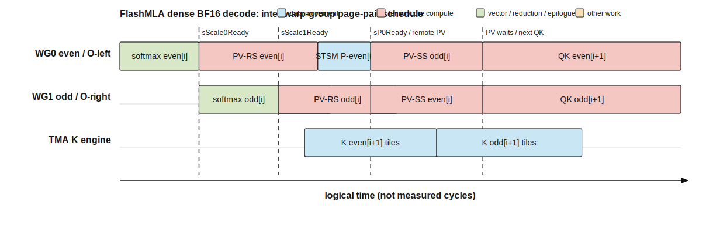
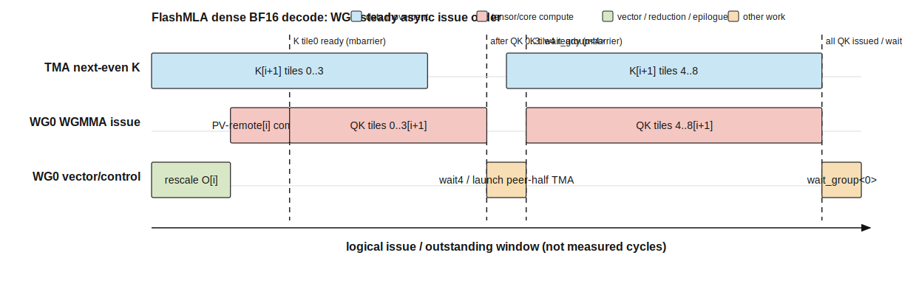

# 01 — Kernel implementation

本文用 `kernel-analysis-skill` 分析 `run_flash_splitkv_mla_kernel<cutlass::bfloat16_t>`。证据分为 **Confirmed (source)**、**Derived** 和 **Inference**；逻辑时间图不代表 cycle。

## 0. Problem definition and tensors

Dense MLA decode 对每个 query 访问完整 paged KV sequence：

```text
P = (Q · Kᵀ) × softmax_scale
S = online_softmax(P, causal_mask)
O = S · V
```

MLA 的 K/V 共用 576 维 BF16 cache；QK 使用全部 576 维，PV 使用前 512 维。

| Argument | Type / layout | Public logical shape | Kernel logical shape | Role |
|---|---|---|---|---|
| `q` | BF16, last dim contiguous | `[b,s_q,h_q,576]` | `[b,q_seq_per_hk,h_kv,576]` | query |
| `kcache` | BF16 paged | `[num_pages,64,h_kv,576]` | page tile `[64,576]` | K and latent V |
| `block_table` | int32 | `[b,max_pages]` | page index stream | logical→physical page |
| `seqlens_k` | int32 | `[b]` | dynamic page count/tail | valid KV length |
| `out` | BF16 | `[b,s_q,h_q,512]` | `[b,h_kv,q_seq_per_hk,512]` | normalized output |
| `oaccum/lseaccum` | FP32 | split-dependent | per scheduler split | partial result for combine |

API 先做：

```text
q_seq_per_hk = s_q × (h_q / h_kv)
q -> [b, q_seq_per_hk, h_kv, 576]
```

默认 MQA `h_q=128,h_kv=1`：`s_q=1` 时一个 CTA 恰好覆盖两个 64-row m-block 中的一个；`s_q=2` 时共有四个 m-block。

## 1. CTA and warp-group partition

Launcher：

```text
grid  = (ceil(q_seq_per_hk/64), h_kv, num_sm_parts)
block = (256,1,1) = 2 warp groups × 128 threads
```

`blockIdx.z` 由 persistent scheduler 分配一个或多个 request 的 page 区间；若 request 被 split，main kernel 写 FP32 accum，随后 combine。

| Execution unit | Threads/warps | Responsibility | Main state | Synchronization |
|---|---:|---|---|---|
| CTA | 256 / 8 | `[64 query rows,512 output cols]` under one KV head/split | `sQ`, `sK0/sK1`, `sP`, `sM/sScale`, two rO halves | TMA barriers + named barriers |
| WG0 | 128 / 4 | even page QK/softmax；output cols `0:256`；local even PV + remote odd PV | `rP0,rO0` | WG1 softmax/P exchange |
| WG1 | 128 / 4 | odd page QK/softmax；output cols `256:512`；local odd PV + remote even PV | `rP1,rO1` | WG0 softmax/P exchange |
| TMA engine | elected thread issues | Q tile、9 K tiles/page、O tile | per-tile transaction barrier | WG0/WG1 wait per K tile |

`sK0/sK1` 是相邻 page 的双缓冲。每个 page `[64,576]` 被拆为 9 个 `[64,64]` K tiles，使后面的 K tile TMA 与前面 tile 的 QK WGMMA 重叠。

## 2. Pipeline and overlap

### Inter-warpgroup page-pair schedule



WG0/WG1 不是简单 producer/consumer：两者各自计算一个 page 的 QK/softmax，同时各拥有一半输出列。online softmax 的共享 `sM` 使 page 顺序仍然是 even→odd：WG0 更新 block0 后通知 WG1；WG1 更新 block1 后返回 scale；两边再通过 shared P 互做 remote PV。

### Intra-warpgroup TMA/WGMMA overlap



这是源码确认的真实 overlap 机制：

- K page 切成 9 个 TMA tiles，每个 tile barrier ready 后立即发射 4 个 `k16` QK WGMMA。
- steady QK 中，tiles 0–7 使用 shared-Q/SS，tile 8 的 Q 被移入 registers，使用 RS；合计 `32 SS + 4 RS`。
- WG0 发射 remote PV 后只 `wait_group<4>`，随后可发射下一 page QK 的前 4 tiles；最后再补 5 tiles并 `wait_group<0>`。
- WG1 在 local/remote PV 的 wait 点发起下一组 K TMA，然后计算 odd page QK。

同步边：

| Boundary | Mechanism | Meaning |
|---|---|---|
| Q ready | `barrier_Q` TMA transaction barrier | 两 WG 可读 `sQ` |
| K tile ready | `barriers_K{0,1}[0..8]` | 对应 64-dim tile 可进入 QK |
| even softmax ready | `sScale0Ready` | WG1 可按最新 global max 处理 odd page |
| odd scale ready | `sScale1Ready` | WG0 可 rescale even P/O |
| even P ready | `sP0Ready` | WG1 可发射 remote PV |
| remote PV issued | `rO1sP0sV0RIssued` | WG0 可安全推进 shared buffer/TMA |
| output reduction | `__syncthreads()` | 两 WG 的 L 和 512 输出列汇合 |

## 3. Important instructions

| Instruction / intrinsic | Evidence | Scope | Purpose | Caveat |
|---|---|---|---|---|
| `SM90_TMA_LOAD` Q | Confirmed source API | GMEM→CTA shared | `[64,576]` Q prologue | PTX/SASS 待确认 |
| `SM90_TMA_LOAD` K tile | Confirmed source API | GMEM→`sK0/sK1` | 9×`[64,64]` per page | per-tile barriers enable overlap |
| QK WGMMA SS/RS `m64n64k16` selector | Confirmed type, count Derived | shared/register Q × shared K | 36 issues/page | exact mnemonic待 SASS |
| PV WGMMA RS/SS `m64n256k16` selector | Confirmed type, count Derived | register/shared P × shared V | 4 local + 4 remote/page | 两 WG 分担 output halves |
| `SM90_U32x4_STSM_N` | Confirmed source atom | registers→shared | softmax P exchange；output staging | 应单独 benchmark stmatrix |
| `SM75_U32x4_LDSM_N` | Confirmed source atom | shared→register | 保存 Q tile8 到 rQ8 | 每 request 一次，非主循环热点 |
| `exp2f` + `shfl_xor` | Confirmed source | registers/warp + shared max | online softmax/rescale | shared-state variant不同于 sparse decode |
| `SM90_TMA_STORE` | Confirmed source API | shared→GMEM | BF16 `[64,512]` output | split path改为 FP32 bulk copy |
| PDL launch attributes | Confirmed launcher/API | kernel-to-combine | main 完成时触发 combine | e2e 必须覆盖两个 kernel |

## Correctness and open evidence

- `grid.x` 的 64-row tiles 无重叠覆盖 `q_seq_per_hk`，尾行由 `num_valid_seq_q` 屏蔽。
- WG0/WG1 分别存 256 output columns，合计 512。
- 每 page 9×64 head-dim tiles 覆盖 576；每 PV 4×16 reduction tiles 覆盖 page size 64。
- even/odd softmax 对同一 `sM` 的更新由 named barriers 串行化。
- K buffer 覆盖前有对应 PV wait/TMA phase，源码注释明确防止 async accumulator serialization。

仍需：BF16 实例的 PTX/SASS 动态计数、H800 trace 中 `wait_group<4>` 的实际 overlap、TMA tile ready stall，以及 PDL main+combine 的真实时间边界。
