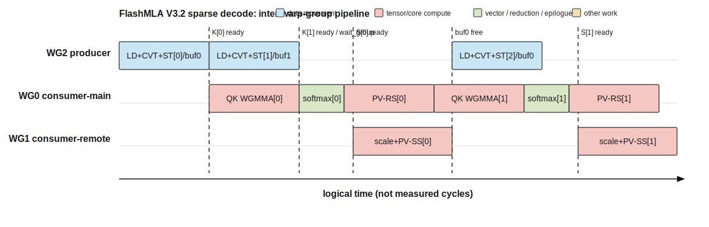

# 01 — Kernel implementation

本文按 `kernel-analysis-skill` 的证据规则分析 `KernelTemplate<ModelType::V32, 128>`。除非特别说明，结论来自 CUDA/CUTLASS 源码；本仓库尚未保存该实例的 PTX、SASS 或 ncu trace。

- **Confirmed (source)**：源码或 launcher 直接给出。
- **Derived**：由固定 shape、索引或循环边界机械推导。
- **Inference**：需要 PTX/SASS、trace 或 H800 实测确认。

## 0. Problem definition and tensors

对每个 query token 和 128 个 query heads，只访问 `indices` 选出的 top-k KV token：

```text
P = (Q · Kᵀ) × sm_scale
S = online_softmax(P)
O = S · V
```

V3.2 的 K/V 共享同一份 latent cache：NoPE 512 维以 FP8 e4m3 存储并带 4 个 FP32 scale，RoPE 64 维保持 BF16。每个 token 的物理行宽为 `512 + 4×4 + 64×2 = 656 B`。

| Argument | Type / physical layout | Logical shape | Role |
|---|---|---|---|
| `q` | BF16, strided | `[b, s_q, h_q, 576]` | 512 NoPE + 64 RoPE query |
| `kv` | FP8 + FP32 scale + BF16 | `[pages, page_block, h_kv=1, 656 B]` | sparse K/V cache |
| `indices` | int32 | `[b, s_q, topk]` | token → page/row address |
| `out` | BF16 | `[b, s_q, h_q, 512]` | attention output |
| `o_accum/lse_accum` | FP32 | scheduler-dependent split dimension | split-KV partial result |

固定实例参数（Confirmed/Derived）：

```text
HEAD_DIM_K       = 576
HEAD_DIM_V       = 512
BLOCK_M          = 64 query heads / CTA
TOPK_BLOCK_SIZE  = 64 KV tokens / loop block
NUM_K_BUFS       = 2
NUM_THREADS      = 384 = 3 warp groups × 128 threads
NUM_M_BLOCKS     = 128 / 64 = 2
CLUSTER_SIZE     = 2 CTAs
```

## 1. CTA, cluster, and warp-group partition

Launcher 配置为：

```text
grid    = (2, s_q, num_sm_parts)
block   = (384, 1, 1)
cluster = (2, 1, 1)
```

`blockIdx.x` 选择 64-head 输出 tile；相邻两个 CTA 构成 cluster，共同覆盖 128 heads。每个 CTA 的 producer 只反量化 32 个 KV token，再把结果写到 peer CTA 的 DSM，因此两个 CTA 最终都得到一个完整 64-token K/V block。

| Execution unit | Threads / warps | Tile or stage responsibility | Main state | Synchronization partner |
|---|---:|---|---|---|
| CTA x=0/1 | 384 / 12 | 输出 `[64 heads, 512]`；cluster 合计 128 heads | dynamic smem `SharedMemoryPlan` | peer CTA via cluster/DSM |
| WG0 | 128 / 4 | QK → online softmax → local half PV；写 O 左 256 列 | `rP/rS/rO_L`, 192-reg allocation | WG2 K-ready；WG1 S-ready/free |
| WG1 | 128 / 4 | scale O → remote half PV；写 O 右 256 列 | `sS/rO_R`, 160-reg deallocation setting | WG0 S handoff；WG2 K-buffer release |
| WG2 | 128 / 4 | index/load → FP8 convert → local shared store → peer DSM store | two K buffers, 152-reg deallocation setting | WG0/WG1 buffer availability |

WG0 对每个 KV block 发射 36 个 `m64n64k16` QK WGMMA，因为 `576/16=36`。softmax 后，WG0 和 WG1 分别发射 4 个 `m64n256k16` PV WGMMA，因为 reduction K 为 `64/16=4`。

## 2. Pipeline and overlap



图的横轴是**逻辑时间**，方块宽度只表达顺序和 overlap，不是 cycle。可确认的外层流水是：WG2 生产 block `i+1`，同时 WG0/WG1 消费 block `i`；K buffer 以 `buf0/buf1` 双缓冲轮换。buffer 只有在 local PV 与 remote PV 都完成相应 arrive 后才能复用。

与给定的 FlashAttention-3 风格 WG 内 overlap 参考图不同，这个实例没有确认到 `QK(i+1)` 与 `softmax(i)` 在同一 WG 内交错：

```text
QK(i) -- warpgroup_wait<0> --> softmax(i) --> PV-local(i) -- warpgroup_wait<0> --> QK(i+1)
```

因此本文不制造第二张“intra-warpgroup overlap”图。若未来 PTX/SASS 或 trace 证明编译器/硬件在这些 wait 边界之外仍有可见 overlap，再补图和模型。

关键同步关系：

| Boundary | Source mechanism | Data made safe |
|---|---|---|
| Q ready | TMA transaction barrier `bar_q` | WG0 可读 `sQ` |
| local/remote K ready | `bar_k_local_ready` + `bar_k_remote_ready` | WG0 可发射 QK |
| S ready | NamedBarrier `sScale_and_sS_ready` | WG1 可读 `sS/sScale` |
| S free | NamedBarrier `sScale_and_sS_free` | WG0 可覆盖共享 softmax buffer |
| K buffer free | `bar_k_avail[buf]` | WG2 可复用 buf0/buf1 |
| output buffer/L ready | NamedBarrier `oBuf_free_and_sL_ready` | WG0/WG1 可进入 store |

## 3. Important instructions

| Instruction / intrinsic | Evidence | Data path / scope | Purpose | Caveat |
|---|---|---|---|---|
| `SM90_TMA_LOAD` / `launch_tma_copy` | Confirmed source API | GMEM Q → CTA shared | 每请求加载 `[64,576]` Q tile | 具体 PTX mnemonic 待编译确认 |
| `load_128b_from_gmem<..., EVICT_LAST, B128/B256>` | Confirmed inline helper use | indexed KV GMEM → registers | sparse FP8/scale/RoPE vector load | cache hint 和 sector 行为需 ncu 验证 |
| `cvt_fp8x8_bf16x8` | Confirmed source helper | registers | FP8 e4m3 × scale → BF16×8 | 实际展开指令序列待 SASS |
| 128-bit local shared store | Confirmed source | registers → CTA shared | 写本地 K/V tile | 与 convert 有数据依赖 |
| `st.async.weak.shared::cluster...` | Confirmed inline PTX helper | registers → peer DSM | cluster2 crossover | 只在 `CLUSTER_SIZE=2` |
| `MMA_64x64x16_F32BF16BF16_SS` | Confirmed CUTLASS type, count Derived | shared Q/K → FP32 rP | QK | emitted WGMMA 待 PTX/SASS |
| `MMA_64x256x16_*` RS/SS | Confirmed CUTLASS type, count Derived | reg/shared S × shared V | local/remote PV | WG0 与 WG1 operand source 不同 |
| `exp2f` + shuffle reduction | Confirmed source | registers/warp | online softmax 与 O rescale | 作为紧耦合原子测量 |
| `SM90_TMA_STORE_5D` | Confirmed source API | shared → GMEM O | 写 `[64,512]` BF16 输出 | split 时写 FP32 accum 的路径不同 |

## Correctness check and open evidence

- 两个 CTA 的 64-head tiles 不重叠，合计覆盖 128 query heads。
- cluster2 下每 CTA 生产 32 token，并通过 local+peer store 让两个 CTA 都拥有完整 64-token block。
- 每个 K buffer 有 producer wait、local/remote ready、两个 consumer release，复用关系闭合。
- WG0/WG1 分别负责输出的 256 列，最终覆盖 `D_V=512`。

仍需补充：固定 CUDA/CUTLASS 版本生成的 PTX/SASS、实际动态指令计数、H800 ncu 的 tensor/DSM/HBM 指标，以及逻辑时间图对应的 measured cycle 比例。
