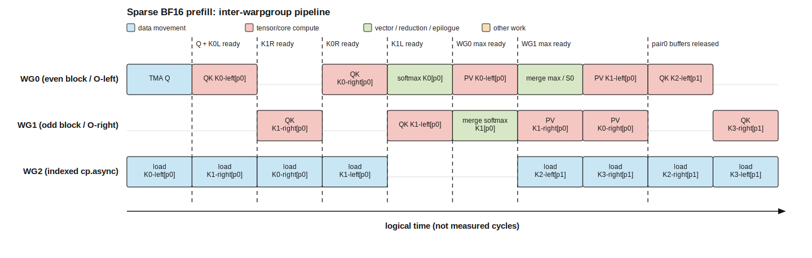
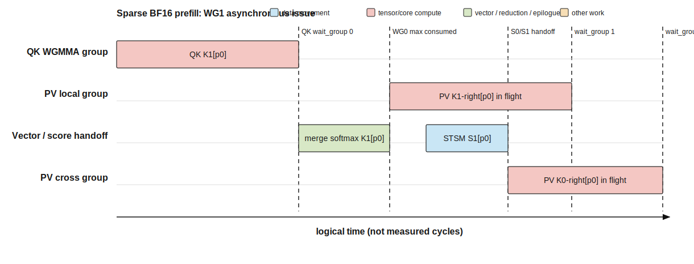

# 01 — Kernel implementation

本文按 `kernel-analysis-skill` 的证据规则分析
`sm90::fwd::KernelTemplate<576, false>`。结论固定到上游 commit
`9241ae3ef9bac614dd25e45e507e089f888280e0`。本仓库尚未保存该实例的
PTX、SASS 或 ncu trace。

- **Confirmed (source)**：源码、launcher 或 inline PTX 直接给出。
- **Derived**：由模板常量、索引和循环边界机械推导。
- **Inference**：必须由 PTX/SASS、trace 或 H800 实测确认。

## 0. Problem definition and tensors

对每个 query token 和 query head，只访问 `indices` 指定的 top-k latent KV 行：

```text
P[h, j] = sm_scale * sum(d=0..575, Q[h,d] * KV[index[j],d])
S[h, :] = softmax(P[h, :])
O[h, v] = sum(j, S[h,j] * KV[index[j],v]),  v=0..511
```

K 使用完整 576 维，V 复用 latent KV 的前 512 维。无 causal mask；非法 index
被 mask 为 `-inf`。public API 还返回每个 head 的 `max_logits` 和 LSE。

| Argument | Type / physical layout | Logical shape | Indexing / stride | Role |
|---|---|---|---|---|
| `q` | BF16, last dim contiguous | `[s_q,h_q,576]` | runtime `stride_q_s_q/stride_q_h_q` | query |
| `kv` | BF16, last dim contiguous | `[s_kv,h_kv=1,576]` | runtime `stride_kv_s_kv/stride_kv_h_kv` | shared latent K/V |
| `indices` | int32 | `[s_q,1,topk]` | runtime strides | sparse gather rows |
| `attn_sink` | optional FP32 | `[h_q]` | contiguous | output normalization only |
| `topk_length` | absent in this instance | `nullptr` | `HAVE_TOPK_LENGTH=false` | fixed `topk` loop bound |
| `out` | BF16 contiguous | `[s_q,h_q,512]` | `[h_q*512,512,1]` | attention output |
| `max_logits/lse` | FP32 contiguous | `[s_q,h_q]` | row-major | statistics |

固定实例参数：

```text
D_Q = D_K = 576; D_V = 512
B_H = 64 heads / CTA
B_TOPK = 64 KV rows / block
NUM_THREADS = 384 = 3 warp groups
topk % 128 == 0
num_topk_blocks = topk / 64
num_block_pairs = topk / 128
```

默认 shape `topk=2048` 因而每 CTA 处理 32 个 64-row block，即 16 个 block pair。

## 1. CTA and warp-group partition

Launcher 配置（Confirmed）：

```text
grid    = ((h_q / 64) * s_q, 1, 1)
block   = (384, 1, 1)
cluster = (1, 1, 1)
```

`q_h_idx = blockIdx.x % (h_q/64)`，`s_q_idx = blockIdx.x / (h_q/64)`。
因此 CTA 唯一覆盖：

```text
CTA(s_q_idx, q_h_idx) -> out[s_q_idx, q_h_idx*64:(q_h_idx+1)*64, 0:512]
```

代表 shape 有 `4096 * 2 = 8192` 个 CTA。该 kernel 没有跨 CTA reduction，
也没有 cluster/DSM 通信。

| Execution unit | Threads / warps | Tile or stage responsibility | Registers/shared memory | Synchronization partner |
|---|---:|---|---|---|
| CTA | 384 / 12 | 一个 query token 的 64 heads × 512 output tile | dynamic `SharedMemoryPlan` | CTA-local barriers only |
| WG0 | 128 / 4 | 偶数 KV block 的 QK/softmax；输出左 256 列；接收 WG1 scores 完成奇数 block 的左半 PV | `rP/rS/rO`, 216-register allocation | WG2 K subtiles；WG1 max/score handoff |
| WG1 | 128 / 4 | 奇数 KV block 的 QK/softmax；输出右 256 列；接收 WG0 scores 完成偶数 block 的右半 PV | `rP/rS/rO`, 216-register allocation | WG2 K subtiles；WG0 max/score handoff |
| WG2 | 128 / 4 | 两个 index block → BF16 KV `cp.async` gather → shared K buffers | `k[0]/k[1]`, 72-register deallocation setting | WG0/WG1 four ready/free barrier pairs |

Shared-memory ownership（Confirmed）：

- `q_o.q`/`q_o.o` 是 union：主循环保存 `[64,576]` Q，epilogue 才复用为 O staging。
- `k[0]`、`k[1]` 分别保存 block pair 的偶数/奇数 64-row BF16 KV tile。
- V 只读 K buffer 的前 512 维；最后 64 维仅参与 QK。
- V3.2 下 `sS0` 复用 `k[0]` 的 RoPE 区域（维 512:576），`sS1` 使用独立 `s[0]`。WG0 在 QK0 完成后才覆盖该区域。

每个 64-row block 的 QK 是 `64x576 @ 576x64`。源码把 576 拆成 9 个
64-wide tile，每个 tile 再由 4 个 K=16 WGMMA 构成，所以是
`9*4=36` 个 `m64n64k16` SS WGMMA。每个 block 的完整 PV 输出被两 WG
各处理 256 列，每个 half 使用 `64/16=4` 个 `m64n256k16` WGMMA。

## 2. Pipeline and overlap



横轴是逻辑时间，不表示 cycle。producer 对一个 block pair 的固定装载顺序为：

```text
K0-left(维0:256) -> K1-right(维256:576)
-> K0-right(维256:576) -> K1-left(维0:256)
```

每个 segment 有独立 `bar_k{0,1}_{ready,free}[half]`。因此 consumer 不必等
整个 128-token pair 全部装完：WG0 在 K0-left ready 后先发射前 16 个 QK
WGMMA，WG1 在 K1-right ready 后先发射后 20 个。WG2 也能在对应 half
被释放后开始下一 pair，形成细粒度 producer/consumer overlap。

一个 pair 的 consumer 数据流（Confirmed）：

```text
WG0: QK(K0) -> softmax K0 -> PV(K0,left,RS)
     -> wait WG1 max/S -> rescale -> PV(K1,left,SS)

WG1: QK(K1) -> wait WG0 max -> softmax K1 -> PV(K1,right,RS)
     -> publish S1 -> PV(K0,right,SS)
```

WG0 先更新 online-softmax state 并发布 `sM`；WG1 把 block1 合并到该 state，
再把新 max 返给 WG0。两个 WG 分别用 STSM 发布自己的 score tile，保证最终
左右两半 O 都累积 K0/K1 两个 block。



第二张图只表达源码可见的异步 issue：WG1 发射 local PV 后，在最终
`warpgroup_wait` 前执行 score STSM/hand-off，并继续发射 cross PV。它不等价于
已测得的 Tensor Core/SFU overlap；实际重叠比例需 trace 确认。

关键同步：

| Boundary | Source mechanism | Data made safe |
|---|---|---|
| Q ready | `bar_q` transaction barrier | WG0/WG1 可读 `sQ` |
| K half ready/free | `bar_k0_*[2]`, `bar_k1_*[2]` + `cpasync_barrier_arrive_noinc` | segment 可被对应 QK/PV 使用或覆盖 |
| valid mask ready | `bar_is_kv_valid_ready` | 两 WG 可 mask score |
| WG0 max ready | `wg0_bunch_0_ready` NamedBarrier | WG1 可合并第二个 block |
| WG1 max ready | `wg1_bunch_0_ready` NamedBarrier | WG0 可 rescale 已有 O/S |
| score tiles ready | `wg0_s0_ready`, `wg1_s1_ready` | cross-half SS PV 可读 shared S |
| L reduction | `sL_ready` NamedBarrier | 两 WG 合并 row sum |
| output tile reusable | per-WG NamedBarrier + TMA store ordering | shared O tile 可被下一 64-col store 覆盖 |

## 3. Important instructions

| Instruction / intrinsic | Evidence | Data path / scope | Purpose | Dependency / caveat |
|---|---|---|---|---|
| `SM90_TMA_LOAD` / `launch_tma_copy` | Confirmed source API | GMEM Q → CTA shared | 一次装入 `[64,576]` Q | emitted PTX mnemonic 待确认 |
| `cp.async.cg.shared.global.L2::cache_hint.L2::256B` | Confirmed inline PTX | indexed BF16 KV GMEM → shared | 16 B/call gather，evict-last policy | pred=false 使用 0-byte source size；需 SASS/ncu 验证 cache behavior |
| `cpasync_barrier_arrive_noinc` | Confirmed source API | CTA mbarrier | 把当前 async-copy group 绑定到 half-ready barrier | 最终 PTX 待确认 |
| `MMA_64x64x16_F32BF16BF16_SS` | Confirmed CUTLASS type; count Derived | shared Q/K → FP32 `rP` | QK，36/block | emitted WGMMA 需 PTX/SASS 固化 |
| `MMA_64x256x16_F32BF16BF16_RS/SS` | Confirmed CUTLASS type; count Derived | register/shared S × shared V | local/cross score PV | 两 WG 共享 Tensor Core throughput，不能把独立 latency 直接 `max` |
| `SM90_U32x4_STSM_N` | Confirmed source API | registers → CTA shared | score handoff与 O staging | bank/swizzle 需 SASS/ncu 核验 |
| `exp2f` + shuffle reduction | Confirmed source | registers/warp | online softmax、O/L rescale | WG1 依赖 WG0 shared max |
| `SM90_TMA_STORE_3D` | Confirmed source API | shared O → GMEM | 8 个 `[64,64]` BF16 tile/CTA | 每 WG 4 个 store；不是单个 64x512 5D store |
| `SM90_BULK_COPY_S2G` | Confirmed source API | shared → GMEM | 写 64 FP32 max + 64 FP32 LSE | 仅 512 B/CTA，先并入 epilogue |

## Correctness check and open evidence

- `blockIdx.x` 的 quotient/remainder 映射使每个 `[query,64 heads]` output tile 恰好由一个 CTA 写入。
- 固定实例要求 `topk % 128 == 0`，所以 pair loop 不需要固定-topk 尾部分支。
- 每个 pair 的 K0/K1 scores 都通过 local+cross PV 覆盖 output 的左右 256 列。
- K buffer 的四个 half 各有 producer wait、ready、consumer release，下一 pair 覆盖前依赖闭合。
- `sS0` 只在 K0 QK `warpgroup_wait<0>` 后覆盖 K0 RoPE 区域；V 不读该 64 维。

仍需：编译 `KernelTemplate<576,false>` 的 PTX/SASS，确认 WGMMA/STSM/TMA
动态指令；记录 ptxas registers/smem 和实际 CTA/SM residency；在 H800 上用 ncu
验证 `cp.async` 字节、L2 命中、双 WG Tensor Core 争用与逻辑图中的 overlap。
